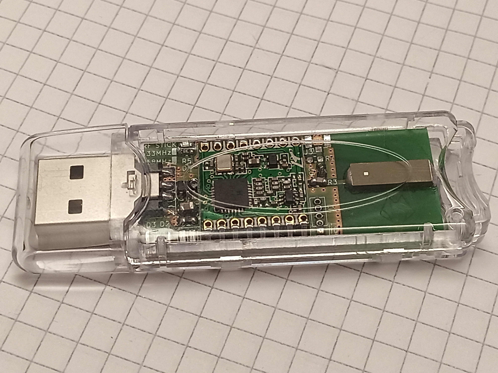
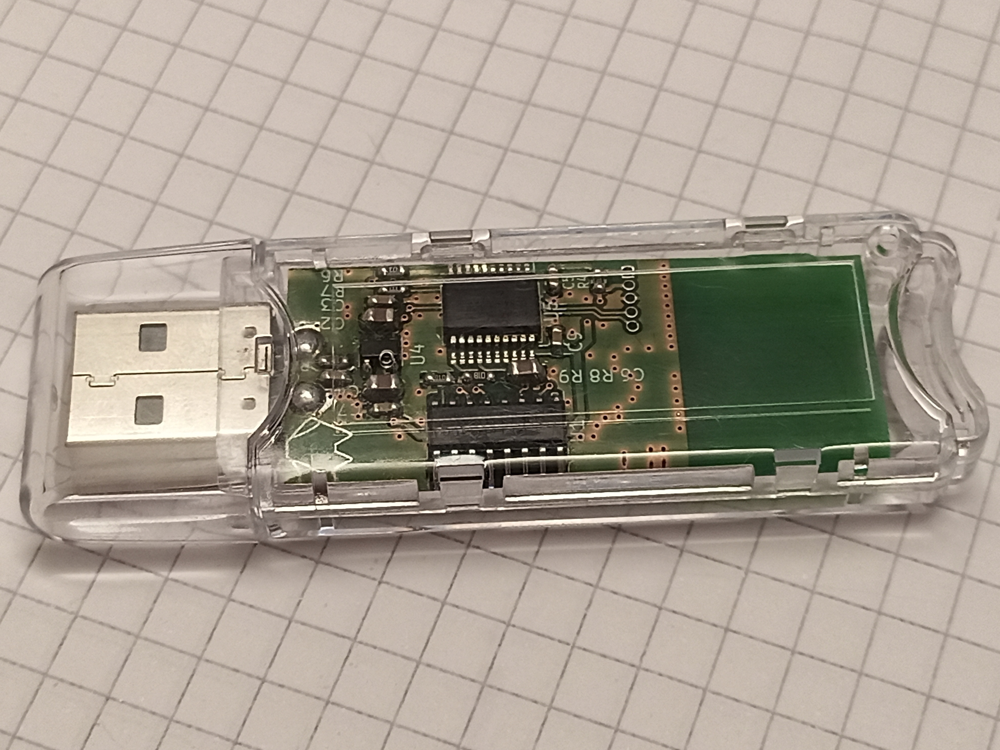
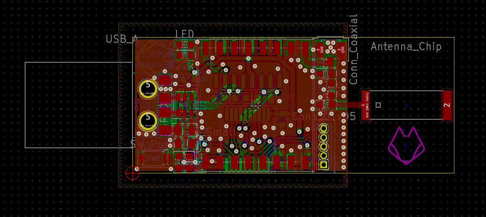

# LIVOLO-RF-Stick
A USB dongle for controlling Livolo RF switches

#### Finished product

*Front view of finished product*


*Back view of finished product*

#### PCB board view

*PCB board view*


## Description

This is a simple dongle for controling Livolo brand RF switched.
It is based around the following components:
- [PIC32MM0064GPL020s](https://www.microchip.com/wwwproducts/en/PIC32MM0064GPL020) microcontroller
- [RFM69](https://www.hoperf.com/modules/rf_transceiver/RFM69HCW.html) module
- CH340G USB-serial converter
- ABRACON [ACAG1204-433-T](https://abracon.com/datasheets/ACAG1204-433-T.pdf) ceramic antenna
- Multicomp [MCG1901](https://uk.farnell.com/multicomp/mcg1901/box-usb-plug-in-clear-polycarbonate/dp/1603603) plastic housing (Wifi dongle style)

#### Performance
Performance is about on-par with the official handheld remote.
Antenna tuning is 72nH in series with antenna, 1pF in parallel with antenna.

#### Extra info

A longer writeup can be found [here](https://neofoxx.com/post-4.html).

## Usage example

Connect to the dongle at 115200bps, 8N1.
Send commands like "COMMAND [...]\n". Commands can be either lower or uppercase.

A help command is implemented, and will printout this:
```
RF stick, for controlling Livolo switches␊
Commands:␊
HELP - Print this help
SCAN - Perform an RSSI scan of a wider area
DEBUG - Print out some diagnostic data
SNIFF [Minimum RSSI] [Timeout] - Sniff for Livolo packets.
-> RSSI should be [-115 to 0]. In practice, use -80, maybe -90 for really weak signals
-> Timeout is in miliseconds. You can put 0 for no timeout. You can always end by sending \n
TRANSMIT [Remote ID] [Keycode] [Number of repeats] - Send a packet many times
-> Remote ID is a 16-bit unsigned number
-> Keycode is a 6-bit unsigned number
-> Number of packets can be [1 to 1000]. Each one takes 8ms, fyi.
----> THIS DOES NOT VERIFY IF YOU DATA IS CORRECT. YOU HAVE TO MAKE SURE THAT YOU HAVE THE RIGHT NUMBER OF 1s!
```

Take special care when sending packets, as the switches are fussy about how many you send -> they **react differently** to how many packets you send.
- ON/OFF commands - 25 to 30 packets is kinda the ideal. If you send more than 50, weird things start happening (lights turning ON and then back OFF or vice versa)
- DIMMING commands - a minimum of 20 packets works reliably. It sometimes works with less, but it's not recommended. This means you can dim the light on in increments, by sending >=20 packets for each UP increment.

Each button on a remote send two different key codes, depending on how you press a button.
- SHORT press - send those 25-30 packets, with a keycode **X**
- LONG press - continues sending packets until release, with keycode **Y**. Used for dimming

To synchronize/bind a key, you **MUST** send the **ON/OFF** command (**SHORT press**). After you put the switch into its "synchronize/learning/binding" mode of course. The switch should respond with a single **beep** when button is bound (at least on my test switch)-

To unbind a key, you *can* send the the **ON/OFF** sequence twice (or just a longer packet), when the switch is in its "synchronize/learning/binding" mode. The switch should responded with two **beeps** when it unbinds (again, works on my test unit).
This also works with a normal remote, if you double-tap a key, though I couldn't find this functionality in the included mini-manual.

#### TLDR
1. Send "SNIFF -90 20", so get the REMOTE_ID and Keycode_ID from your existing remote
2. Send "TRANSMIT [REMOTE_ID] [Keycode_ID] 25" for ON/OFF commands
3. Send "TRANSMIT [REMOTE_ID] [Keycode_ID] [DO_YOUR_OWN_MATH]" for dimming commands. Time sending packets = (8ms * number_of_packets), or flipped, number_of_packets = total_time_in_ms / 8.